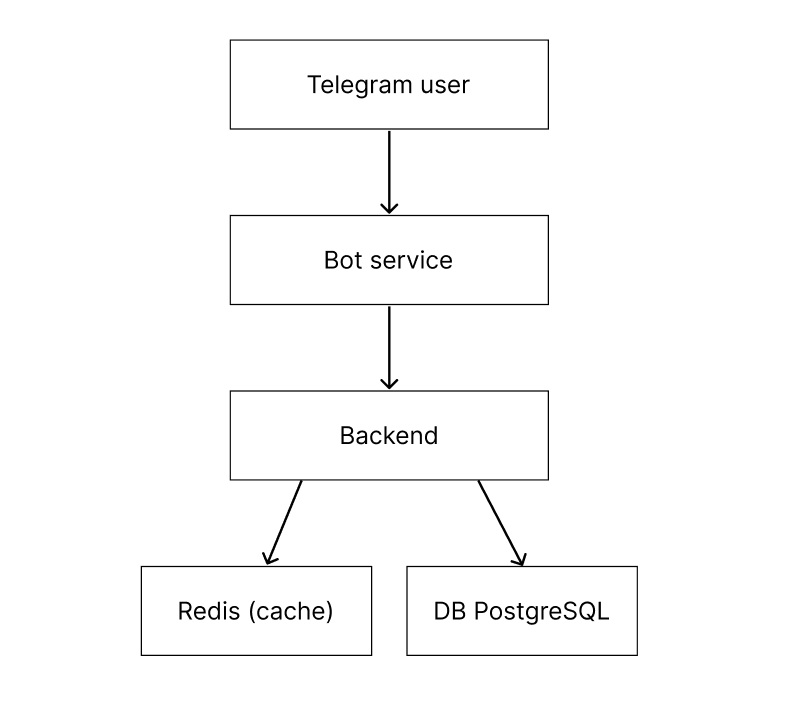

# Этап 1: Планирование и проектирование Dating Bot

## 1. Описание сервисов

Система представляет собой dating-приложение на основе Telegram-бота.

### 1. Bot Service
Отвечает за взаимодействие с пользователем через Telegram:
- регистрация пользователя (/start)
- просмотр анкет
- лайки / пропуски
- запуск диалогов при совпадении

### 2. Backend (API)
Основная бизнес-логика приложения:
- обработка пользователей
- работа с анкетами (CRUD)
- обработка лайков и мэтчей
- расчёт рейтинга
- взаимодействие с БД и Redis

### 3. Database (PostgreSQL)
Хранение всех данных:
- пользователи
- анкеты
- лайки
- мэтчи
- рейтинги

### 4. Redis (кэш)
Используется для:
- хранения предзагруженных анкет
- ускорения выдачи анкет пользователю

### 5. Celery (фоновые задачи)
Используется для:
- пересчёта рейтингов пользователей
- выполнения отложенных задач

## 2. Архитектура системы

Система построена по простой клиент-серверной архитектуре:

- Telegram пользователь взаимодействует с ботом
- Бот отправляет запросы в Backend
- Backend работает с БД и Redis
- Все вычисления происходят прямо в Backend (без фоновых задач)

## 3. Схема данных (База данных)

### Таблица users
- id 
- telegram_id
- created_at

### Таблица profiles
- id
- user_id 
- name
- age
- gender
- city
- bio
- created_at

### Таблица likes
- id
- from_user_id
- to_user_id
- created_at

### Таблица matches
- id
- user1_id
- user2_id
- created_at

### Таблица ratings
- id
- user_id
- primary_score
- behavior_score
- total_score
