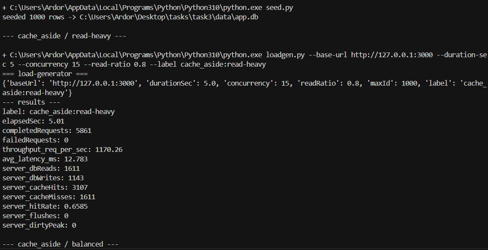
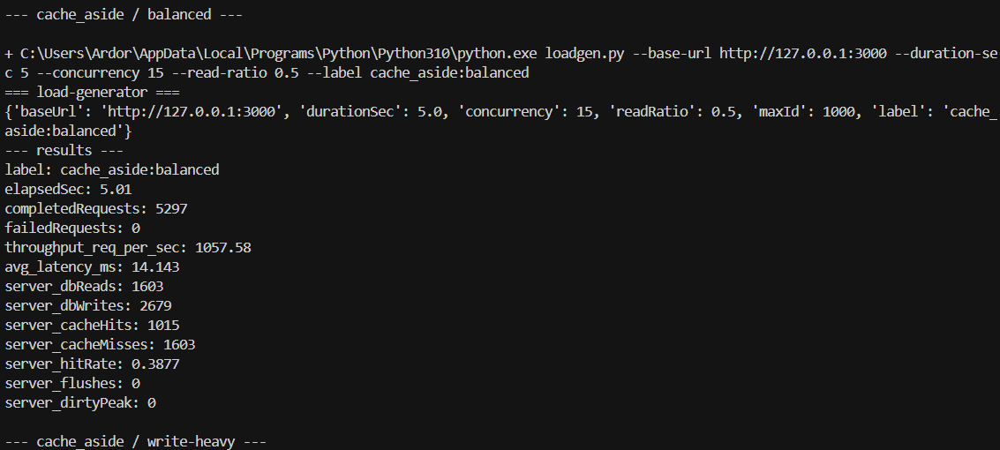
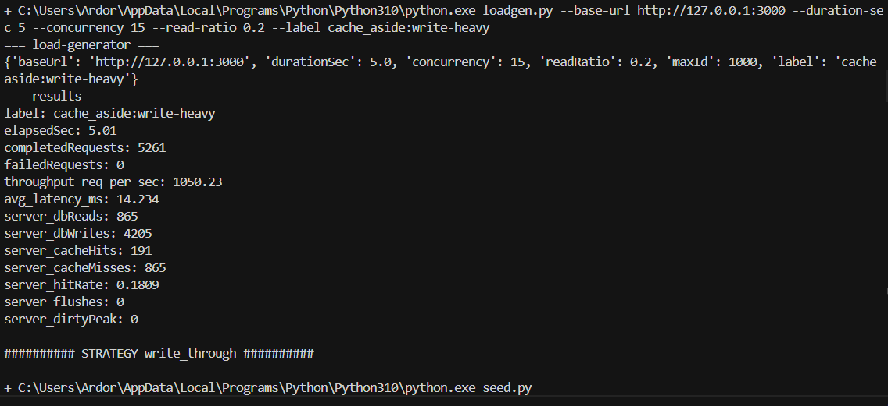
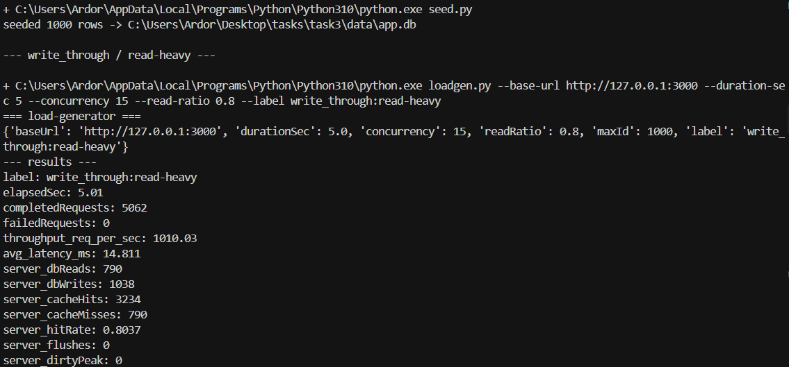
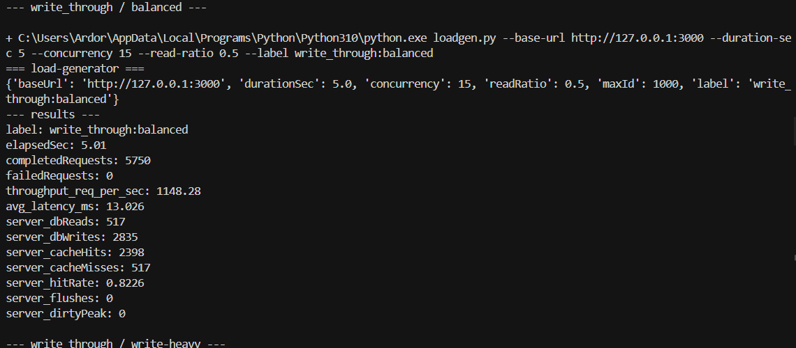
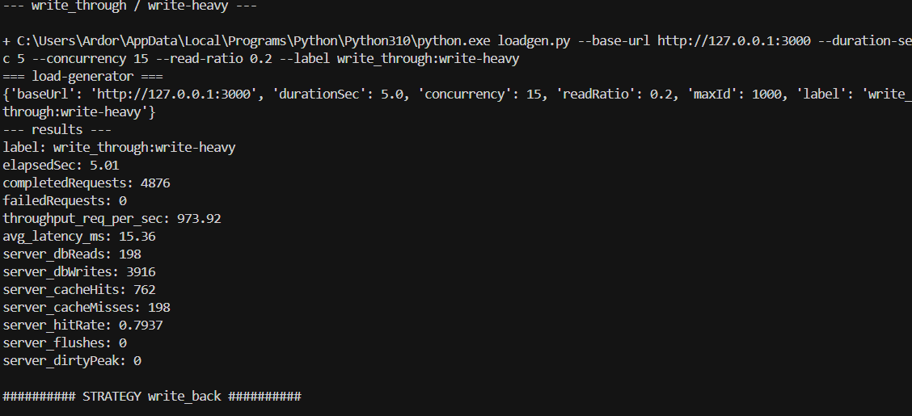
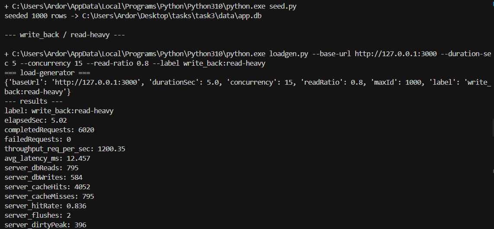
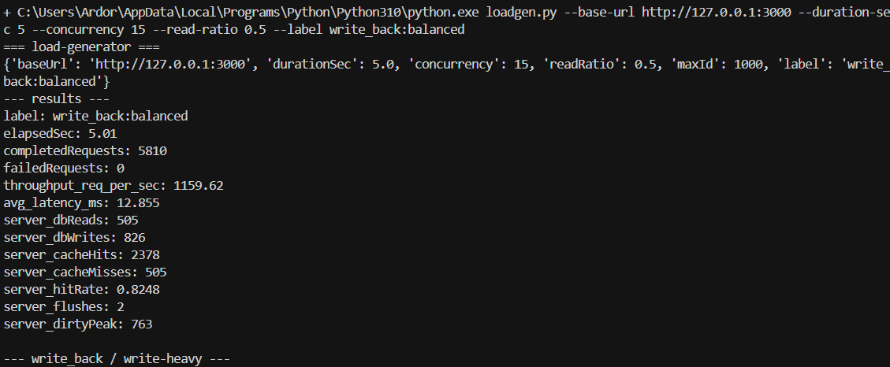
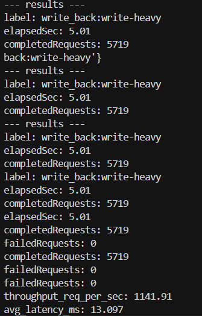

# Отчёт: сравнение стратегий кеширования 

## Состав 

| Компонент | Реализация |
|-----------|------------|
| БД | SQLite, файл `data/app.db` |
| Кеш | Redis (`docker-compose.yml`) |
| Приложение | Один файл **`app.py`** (Flask + `redis` + sqlite3 из стандартной библиотеки) |
| Нагрузка | **`loadgen.py`** (только stdlib: `urllib` + потоки) |
| Матрица прогонов | **`run_matrix.py`** (поднимает приложение по очереди для каждой стратегии) |

Стратегия задаётся переменной окружения **`CACHE_STRATEGY`**: `cache_aside`, `write_through`, `write_back`.

## Как запустить

1. Redis: в каталоге `task3` выполнить `docker compose up -d` (если порт 6379 занят — используйте уже запущенный Redis или измените порт и `REDIS_URL`).
2. Зависимости: `pip install -r requirements.txt`
3. Полная матрица тестов: `python run_matrix.py`  
   Длительность одного прогона: переменные `TEST_DURATION_SEC`, `TEST_CONCURRENCY` (по умолчанию 5 с и 15 потоков).

Вручную: в одном терминале `set CACHE_STRATEGY=write_through` (Windows) или `export CACHE_STRATEGY=write_through` (Linux/macOS), затем `python app.py`; в другом — `python loadgen.py --read-ratio 0.8`.

## Тесты

Три профиля: **read-heavy** (0.8 read), **balanced** (0.5), **write-heavy** (0.2). Перед каждым профилем вызывается `POST /admin/isolate-test` (очистка Redis, пересидирование БД, сброс счётчиков).

## Метрики

- **throughput** и **avg_latency_ms** — на стороне клиента (`loadgen.py`).
- **dbReads / dbWrites / hitRate / flushes / dirtyPeak** — `GET /metrics` в приложении.

## Таблица результатов

Фактические результаты прогона `python run_matrix.py` (`TEST_DURATION_SEC=10`, `TEST_CONCURRENCY=20`):

| Стратегия | Профиль | throughput (req/s) | avg latency (ms) | dbReads | dbWrites | hitRate | write_back: dirtyPeak / flushes |
|-----------|---------|-------------------|------------------|---------|----------|---------|----------------------------------|
| cache_aside | read-heavy | 661.57 | 30.146 | 1708 | 1307 | 0.6787 | - |
| cache_aside | balanced | 1060.17 | 18.793 | 2922 | 5309 | 0.4504 | - |
| cache_aside | write-heavy | 891.61 | 22.358 | 1461 | 7166 | 0.1769 | - |
| write_through | read-heavy | 636.68 | 31.317 | 806 | 1276 | 0.8421 | - |
| write_through | balanced | 511.72 | 38.960 | 486 | 2576 | 0.8097 | - |
| write_through | write-heavy | 470.69 | 42.115 | 179 | 3809 | 0.8042 | - |
| write_back | read-heavy | 651.48 | 30.599 | 795 | 1097 | 0.8469 | 310 / 4 |
| write_back | balanced | 568.80 | 35.013 | 493 | 1432 | 0.8253 | 588 / 3 |
| write_back | write-heavy | 544.41 | 36.560 | 222 | 1454 | 0.8021 | 820 / 2 |

## Выводы по результатам

- **Для чтения (read-heavy):** по hit rate лидирует `write_back` (0.8469), очень близко `write_through` (0.8421). По throughput в этом прогоне немного выше `cache_aside` (661.57 req/s), но у него заметно ниже hit rate и больше обращений к БД.
- **Для записи (write-heavy):** лучшим выглядит `write_back`: меньше записей в БД (`dbWrites=1454`) за счёт отложенного сброса, чем у `write_through` (`3809`) и `cache_aside` (`7166`), при этом latency ниже, чем у `write_through`.
- **Для смешанной нагрузки (balanced):** самым стабильным по согласованности кеша и БД является `write_through` (высокий hit rate 0.8097), но в данном тесте по throughput лидирует `cache_aside` (1060.17 req/s). Это связано с особенностями текущего окружения (локальный запуск, SQLite, параметры потоков).
- **Накопление в write-back:** `dirtyPeak` растёт от 310 (read-heavy) до 820 (write-heavy), что подтверждает буферизацию записей в кеше; `flushes` показывает количество фоновых циклов выгрузки в БД.
- **Практический выбор:** если важна минимальная нагрузка на БД при частых записях — `write_back`; если нужна более предсказуемая синхронная консистентность — `write_through`; `cache_aside` проще всего по логике и часто хорошо масштабируется, но сильнее зависит от паттерна инвалидации.

