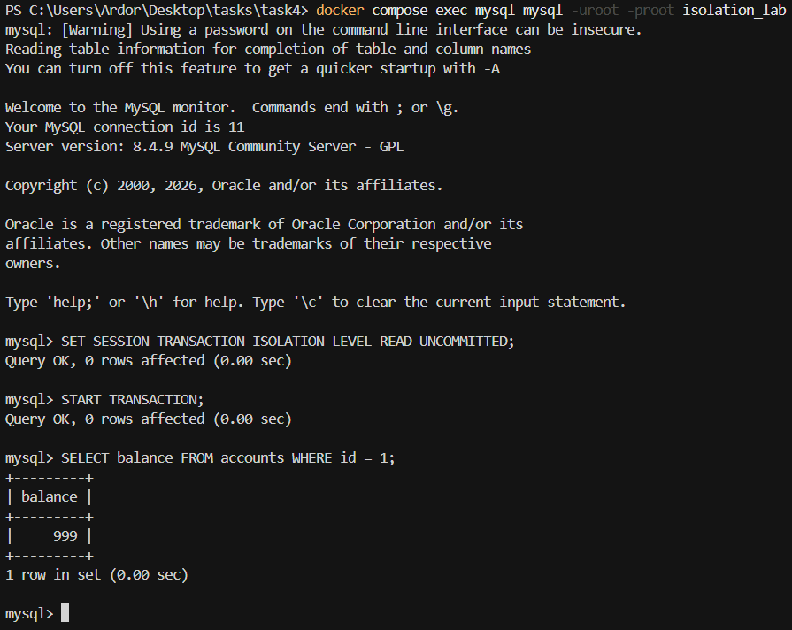
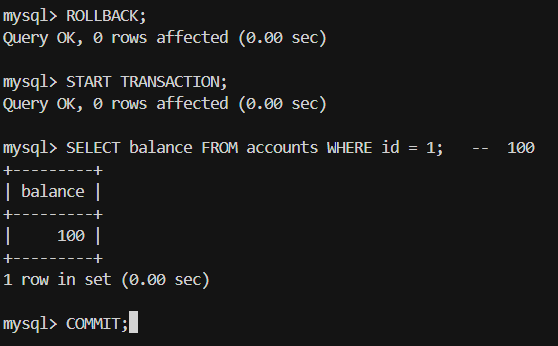
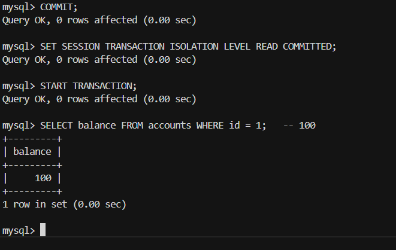
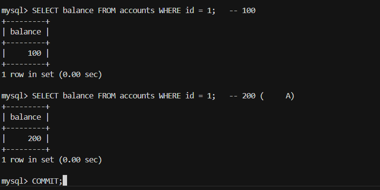

# Отчёт: аномалии изоляции в SQL 

## Выбранные аномалии

1. **Dirty read** (грязное чтение) — `sql/01_dirty_read.sql`
2. **Non-repeatable read** (неповторяемое чтение) — `sql/02_non_repeatable_read.sql`
3. **Phantom read** (фантомное чтение) — `sql/03_phantom_read.sql`
4. **Lost update** (потерянное обновление) — `sql/04_lost_update.sql`

СУБД: **MySQL 8** (контейнер из `docker-compose.yml`, порт хоста **3307** → 3306 в контейнере, БД `isolation_lab`, пользователь `root` / пароль `root`).

## Подготовка

```text
cd task4
docker compose up -d
docker compose exec -T mysql mysql -uroot -proot isolation_lab < sql/00_setup.sql
```

Дальше сценарии выполняются в **двух параллельных сессиях** (два окна `mysql` или два подключения в DBeaver / DataGrip). В скриптах помечено, что выполняет **«Сессия A»** и **«Сессия B»**.

---

## 1. Dirty read

### Таблица и данные

`accounts(id, balance)` — см. `sql/00_setup.sql`, строка `id=1`, начальный `balance=100`.

### Две параллельные транзакции

| Шаг | Сессия A | Сессия B |
|-----|----------|----------|
| 1 | `START TRANSACTION;` | |
| 2 | `UPDATE accounts SET balance = 999 WHERE id = 1;` | |
| 3 | | `SET SESSION TRANSACTION ISOLATION LEVEL READ UNCOMMITTED;` |
| 4 | | `START TRANSACTION;` |
| 5 | | `SELECT balance FROM accounts WHERE id = 1;` → **999** |
| 6 | `ROLLBACK;` | |
| 7 | | `SELECT balance FROM accounts WHERE id = 1;` → снова **100** |
| 8 | | `COMMIT;` |

### Зафиксированный результат

Сессия B на шаге 5 прочитала **незафиксированное** значение 999; после отката A фактическое значение снова 100 — значит, чтение было «грязным».

### Как избежать

Не использовать `READ UNCOMMITTED` для рабочих запросов; в InnoDB применять как минимум **READ COMMITTED** (лучше осознанный выбор уровня под задачу).

---

## 2. Non-repeatable read

### Таблица и данные

Та же `accounts`, `id=1`.

### Параллельные транзакции

- **A:** `SET SESSION ... READ COMMITTED;` → `START TRANSACTION` → первый `SELECT balance` (например 100).
- **B:** `UPDATE ... SET balance = 200` → `COMMIT`.
- **A:** повторный `SELECT balance` в той же транзакции → **200** (отличается от первого чтения).

### Результат

В одной транзакции A два одинаковых по тексту запроса дали разные значения из-за коммита B.

### Как избежать

**REPEATABLE READ** / **SERIALIZABLE** или блокировка строки при первом чтении: `SELECT ... FOR UPDATE`.

---

## 3. Phantom read

### Таблица и данные

`orders(id, amount)` — начальные строки из `00_setup.sql`.

### Параллельные транзакции

- **A:** `READ COMMITTED`, `START TRANSACTION`, `SELECT ... WHERE amount > 15` — зафиксировать число строк.
- **B:** `INSERT INTO orders (amount) VALUES (99);` → `COMMIT`.
- **A:** повтор того же `SELECT` — появляется **новая строка** (фантом).

### Результат

Второй диапазонный запрос увидел строку, которой не было при первом чтении в этой транзакции.

### Как избежать

**SERIALIZABLE** или понимание блокировок InnoDB на **REPEATABLE READ** (next-key locks снимают часть фантомов; для учебного примера удобен **READ COMMITTED**).

---

## 4. Lost update

### Таблица и данные

`accounts`, `balance = 100` для `id = 1`.

### Параллельные транзакции

Обе сессии на **READ COMMITTED** читают 100. A пишет `balance = 110` и коммитит. B пишет `balance = 120` (исходя из устаревшего чтения 100+20) и коммитит.

### Результат

Итоговый `balance` **120** — приращение от A (**+10**) потеряно относительно ожидаемой сериализации «сначала +10, потом +20» (130).

### Как избежать

Атомарно: `UPDATE accounts SET balance = balance + ? WHERE id = 1`; либо **SELECT ... FOR UPDATE**; либо оптимистичная блокировка по версии столбца.

---

## Скриншоты

Для каждой аномалии: два окна клиента с шагами A/B и результатом `SELECT` / состоянием таблицы


видно 999 до ROLLBACK в A и 100 после ROLLBACK


2) Non-repeatable read

